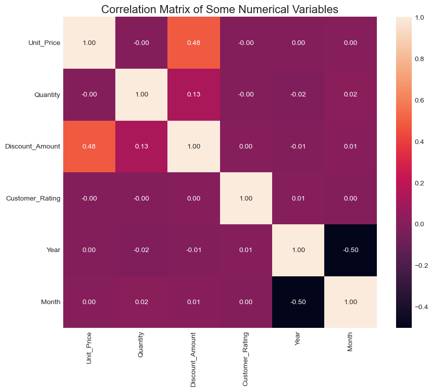
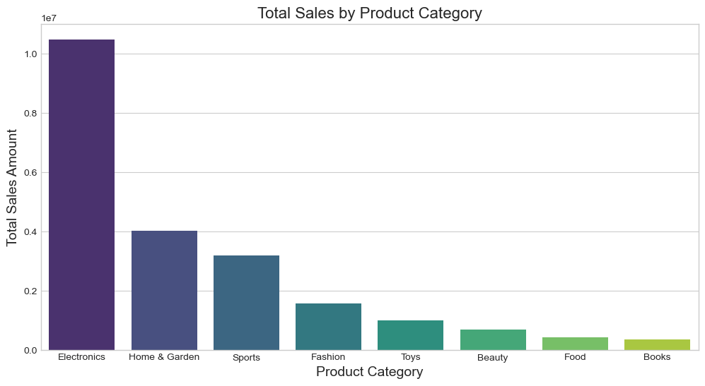
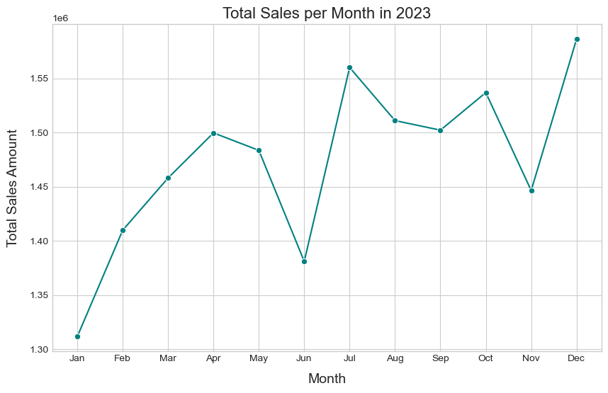
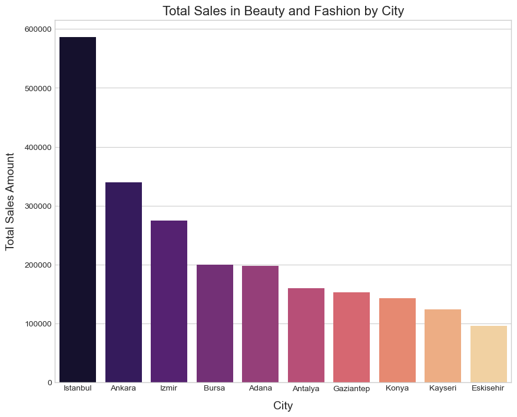
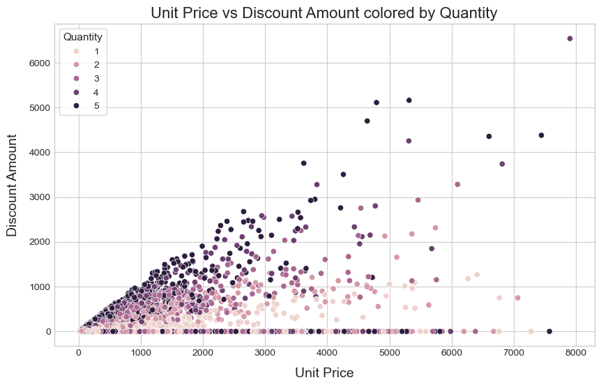
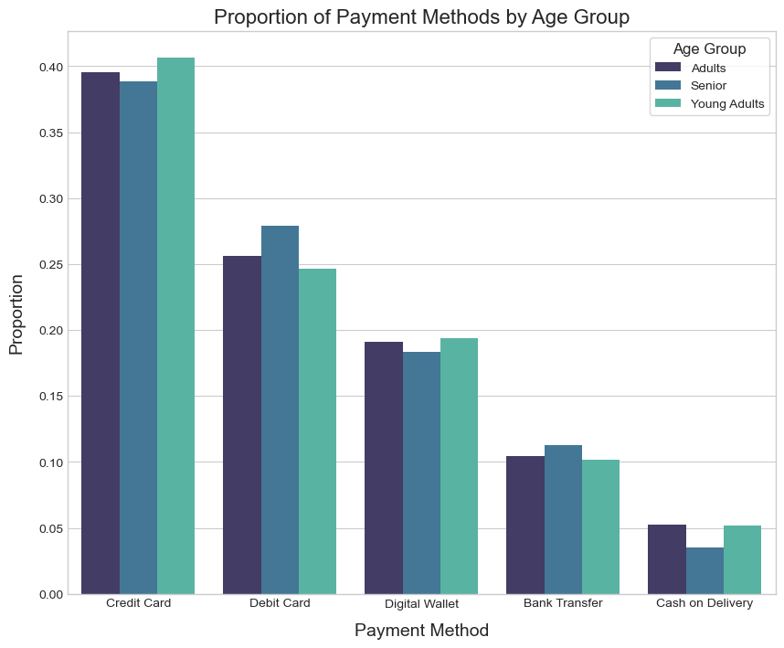
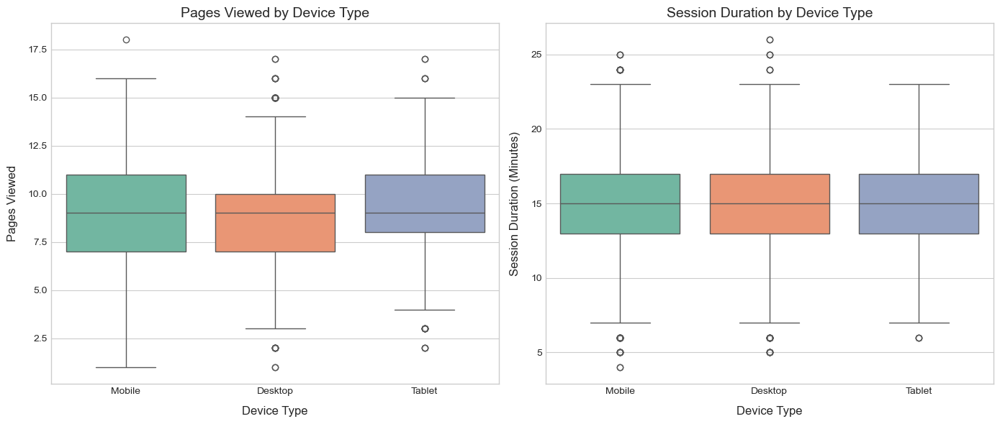
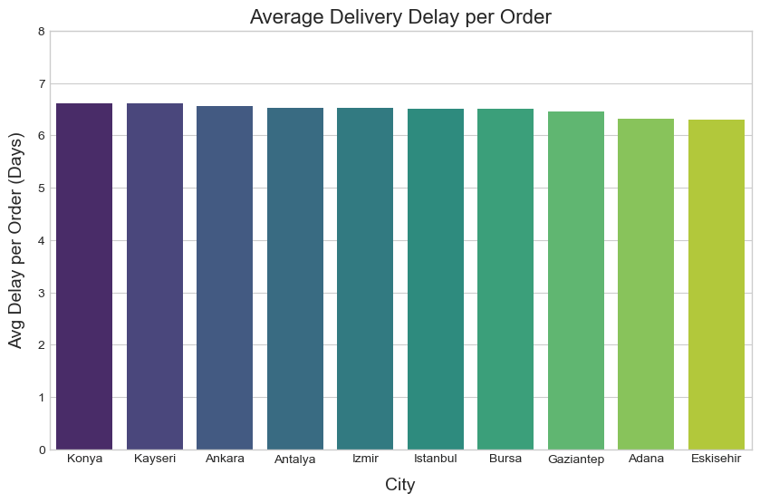

# Exploratory Data Analysis Project

You can find the dataset:
*https://www.kaggle.com/datasets/umuttuygurr/e-commerce-customer-behavior-and-sales-analysis-tr*

## 1. Introduction
<p align="justify">
This project uses an e-commerce dataset containing sales data from several cities in Türkiye. The dataset is employed to perform an <strong>Exploratory Data Analysis (EDA)</strong>. Throughout this project, we will:
</p>
<strong>1-</strong> Import the required libraries <br>
<strong>2-</strong> Load the dataset <br>
<strong>3-</strong> Perform Exploratory Data Analysis <br>
<strong>3.1-</strong> Understand the structure and content of the dataset <br>
<strong>3.2-</strong> Identify NaN values, duplicates, and outliers <br>
<strong>3.3-</strong> Analyze correlations among the dataset features <br>
<strong>3.4-</strong> Answer business-oriented questions of financial interest, such as: <br>
<strong>3.4.1-</strong> Which cities generate the highest total sales in the Beauty and Fashion categories? <br>
<strong>3.4.2-</strong> How do discounts affect the quantity of items purchased? <br>
<strong>3.4.3-</strong> What are the most popular payment methods by age group? <br>
<strong>3.4.4-</strong> How does device type influence user engagement, measured by pages viewed and session duration? <br>
<strong>3.4.5-</strong> Which cities have the lowest average delivery time (most efficient delivery)? <br>
<strong>4-</strong> Key takeaways <br>


## 2. Importing Libraries 
<p align="justify">
We will be working in this dataset with 3 libraries, </strong>pandas</strong> for tabular data managment, <strong>matplotlib.pyplot</strong> and <strong>seaborn</strong> for visualization:
</p>

```python
import pandas as pd
import matplotlib.pyplot as plt
import seaborn as sns

# Plot style that I like
plt.style.use('seaborn-v0_8-whitegrid')
```

## 3. Importing Dataset
In this step, we are going to use pandas to import the data, and use head() to explore the first five rows of the data:
```python
file_path = './data/ecommerce_customer_behavior_dataset_v2.csv'

data_sales = pd.read_csv(file_path)
data_sales.head()
```

<details>
  <summary>Click to see output of <strong>head()</strong> </summary>

<div align="center">
  
</div>
<p><strong>Figure 1.</strong> First 5 rows of the dataset

</details>

## 4. Exploratory Data Analysis

### 4.1 Understanding the Dataset

<p align="justify"> We first use the <strong>shape</strong> attribute to determine the size of the dataset. Then, we apply the <strong>info()</strong> method to inspect column data types and identify potential missing values.

```python
data_sales.info()
```

<details>
  <summary>Click to see output of <strong>info()</strong> </summary>
<div align="center">
  
</div>
<p><strong>Figure 2.</strong> Info method output with the dtypes of each column

</details>

<p align="justify">

From the output, we observe that the dataset contains: </br>

- 8 <strong>numerical</strong> columns </br>

- 8 <strong>object</strong> type columns </br>

- 1 <strong>boolean</strong> column </br>

</p>

<p align="justify"> Additionally, we can confirm that the dataset contains <strong>no NaN values</strong>, which is further validated using the <strong>isna().sum()</strong> method. </p>


### 4.2 Null values, outliers and duplicates

```python
data_sales.isna().sum()
```

<details>
  <summary>Click to see output of <strong>isna().sum()</strong> </summary>
<div align="center">
  
</div>
<p><strong>Figure 3.</strong> Isna method output with 0 NaN values  

</details>

<p align="justify"> After confirming the absence of missing values, we searched for <strong>outliers</strong> and <strong>duplicate records</strong>. To identify potential outliers, histograms were generated for all numerical variables. This approach allows for a quick visual inspection of abnormal distributions. </p>

```python
data_sales.hist(figsize=(12, 8), bins=30)

```

<div align="center">
  
</div>
<p><strong>Figure 4.</strong> Histograms of numerical columns to look for outliers

<p align="justify"> We then checked for duplicate rows using the <strong>duplicated().sum()</strong> method. </p>

```python
data_sales.duplicated().sum()
```
<details>
  <summary>Click to see output of <strong>duplicated().sum()</strong> </summary>

<div align="center">
  
</div>
<p><strong>Figure 5.</strong> Duplicates output, showing the absence of duplicate entries in the dataset

</details>

<p align="justify"> Based on the histogram analysis and duplicate check, all numerical features fall within reasonable ranges, indicating the absence of obvious outliers or duplicate entries in the dataset. </p>

### 4.3 Features Correlation

<p align="justify"> The objective of this section is to analyze correlations among numerical features using several visualization techniques, including <strong>heatmaps</strong>, <strong>bar charts</strong>, and a <strong>line chart</strong> to assess sales evolution over time. </p>

```python
num_variables_corr = ['Unit_Price', 'Quantity', 'Discount_Amount', 'Customer_Rating', 'Year', 'Month']
corr_matrix = data_sales[num_variables_corr].corr()

plt.figure(figsize=(10, 8))
sns.heatmap(corr_matrix, 
            annot=True, 
            fmt=".2f")

plt.title('Correlation Matrix of Some Numerical Variables', fontsize=16)
plt.show()
```

<div align="center">
  
</div>
<p><strong>Figure 6.</strong> Some features Pearson's correlation heatmap

<p align="justify">
Since we are using a Pearson correlation matrix, the analysis captures linear relationships between numerical variables only. Based on the results, the following insights can be drawn: </br>

- There is a strong positive correlation between Unit Price and Discount Amount, as well as between Discount Amount and Quantity sold, suggesting that higher-priced items tend to receive larger discounts and that discounts are associated with increased sales volume. </br>

- Although the heatmap shows no correlation between Unit Price and Quantity, this does not imply the absence of a relationship. Rather, it indicates that there is no strong linear relationship between these variables. </br>

- The correlation matrix also suggests no significant linear relationship between Discount Amount and Month, indicating that discounts do not follow a consistent seasonal pattern across the year. </br>

</p>

```python
product_total_sales = data_sales.groupby('Product_Category')['Total_Amount'].sum().sort_values(ascending=False)

plt.figure(figsize=(12, 6))

sns.barplot(
    x=product_total_sales.index,
    y=product_total_sales.values,
    palette='viridis',
    hue=product_total_sales.index,
    legend=False
)

plt.xlabel('Product Category', fontsize=14)
plt.ylabel('Total Sales Amount', fontsize=14)
plt.title('Total Sales by Product Category', fontsize=16)
plt.show()
```

<div align="center">
  
</div>
<p><strong>Figure 7.</strong> Total sales distribution per category

<p align="justify">
- The graph shows that customers spend the most on electronics, while books account for the lowest total sales.
</p>

```python
sales_per_month = data_sales.groupby(['Month', 'Year'])['Total_Amount'].sum().unstack()

sales_per_month = (
    data_sales
    .query('Year == 2023')
    .groupby('Month')['Total_Amount']
    .sum()
)

plt.figure(figsize=(10, 6))
sns.lineplot(
    x=sales_per_month.index,
    y=sales_per_month.values,
    marker='o', 
    color='teal',
)

month_dic = {
    1: 'Jan', 2: 'Feb', 3: 'Mar', 4: 'Apr',
    5: 'May', 6: 'Jun', 7: 'Jul', 8: 'Aug',
    9: 'Sep', 10: 'Oct', 11: 'Nov', 12: 'Dec'
}

plt.xlabel('Month', fontsize=14, labelpad=10)
plt.ylabel('Total Sales Amount', fontsize=14, labelpad=10)
plt.title('Total Sales per Month in 2023', fontsize=16)
plt.xticks(sales_per_month.index, labels=[month_dic[m] for m in sales_per_month.index])
plt.show()
```

<div align="center">
  
</div>
<p><strong>Figure 8.</strong> Total sales time evolution in the year 2023

<p align="justify">

Insights drawn from the graph: </br>

- Sales reach their highest level in December, which may be driven by holiday-related spending, such as Christmas promotions and gift purchases. </br>

- A sharp decline in January follows the December peak, potentially reflecting post-holiday budget adjustments and reduced consumer spending. </br>

- After the early-year slowdown, sales gradually increase toward the beginning of the summer period, possibly influenced by seasonal demand and vacation-related purchases.</br>

</p>

### 4.4 Responding Initial Questions

#### 4.4.1 Which cities generate the highest total sales in the Beauty and Fashion categories? 

<p align="justify"> To answer this question, we filtered the dataset to include only the Beauty and Fashion categories. We then grouped the data by city and calculated the total sales amount. </p>

```python
city_beauty_fashion = (data_sales.query('Product_Category == "Beauty" or Product_Category == "Fashion"')
                       .groupby('City')['Total_Amount']
                       .sum()
                       .sort_values(ascending=False)
                       )

plt.figure(figsize=(10, 8))

sns.barplot(
    x=city_beauty_fashion.index,
    y=city_beauty_fashion.values,
    palette='magma',
    hue=city_beauty_fashion.index,
    legend=False
)

plt.xlabel('City', fontsize=14, labelpad=10)
plt.ylabel('Total Sales Amount', fontsize=14, labelpad=10)
plt.title('Total Sales in Beauty and Fashion by City', fontsize=16)
plt.show()
```

<div align="center">
  
</div>
<p><strong>Figure 9.</strong> Top cities in Beauty and Fashion purchases

<p align="justify">

- Istanbul records the highest sales in beauty and fashion, likely influenced by its population size and market scale. </br>

- Although Adana has a smaller population than Antalya and Konya, it exhibits comparatively higher fashion and beauty spending, indicating potential differences in consumer preferences or income distribution. </br>

</p>

#### 4.4.2 How do discounts affect the quantity of items purchased?

<p align="justify"> A scatter plot was used to visualize the relationship between discount amount and unit price, with points classified by the quantity sold. </p>

<div align="center">
  
</div>
<p><strong>Figure 10.</strong> Influence of discount in amount of items purchased

<p align="justify"> - The results indicate that higher discounts are associated with larger quantities purchased, suggesting that discounts play a significant role in increasing sales volume. </p>

#### 4.4.3 What are the most popular payment methods by age group?

<p align="justify"> An <strong>Age_Group</strong> variable was created to classify customers into Young Adults, Adults, and Seniors. Payment method proportions were then calculated for each group. </p>

```python
# Creating Age_Group column
data_sales['Age_Group'] = data_sales['Age'].apply(lambda x: 'Young Adults' if x < 30 else ('Adults' if x < 60 else 'Senior'))

payment_methods_age = (data_sales.groupby('Age_Group')['Payment_Method']
                       .value_counts(normalize=True)
                       .rename('Proportion')
                       .reset_index())
payment_methods_age


plt.figure(figsize=(10, 8))

sns.barplot(
    data=payment_methods_age,
    x='Payment_Method',
    y='Proportion',
    hue='Age_Group',
    palette='mako'
)

plt.xlabel('Payment Method', fontsize=14, labelpad=10)
plt.ylabel('Proportion', fontsize=14, labelpad=10)
plt.title('Proportion of Payment Methods by Age Group', fontsize=16)
plt.legend(title='Age Group', title_fontsize=12, frameon=True)
plt.show()

```

<div align="center">
  
</div>
<p><strong>Figure 11.</strong> Influence of age in payment method selected

<p align="justify">

- Credit cards are the most commonly used payment method across all age groups, while only about 5% of customers in each age category pay in cash

</p>

#### 4.4.4 How does device type influence user engagement, measured by pages viewed and session duration?

<p align="justify"> Two box plots were used to analyze the effect of device type on the number of pages viewed and session duration. </p>

<div align="center">
  
</div>
<p><strong>Figure 12.</strong> Influence of device type pages viewed and session duration

<p align="justify">

- Customers predominantly use mobile devices for online purchases in this store, visiting on average around 9 pages before completing a purchase, with a maximum of 11 pages viewed. </br>

- However, device type does not appear to strongly influence the amount of time users spend online before making a purchase, with a median session duration of 15 minutes across all three device types. </br>

</p>

#### 4.4.5 Which cities have the lowest average delivery time (most efficient delivery)?

<p align="justify"> We grouped the data by city and calculated the average delivery delay per order. </p>


```python

# Calculating average delivery delay per order by city
rank_delay_df = (
    data_sales
    .groupby('City')
    .agg(
        Number_of_Orders=('City', 'size'),
        Total_delivery_time=('Delivery_Time_Days', 'sum')
    )
    .assign(Delay_per_order=lambda x: x['Total_delivery_time'] / x['Number_of_Orders'])
    .sort_values('Delay_per_order', ascending=False)
)

plt.figure(figsize=(10, 6))
sns.barplot(data = rank_delay_df,
            x=rank_delay_df.index, 
            y='Delay_per_order', 
            palette='viridis',
            hue = rank_delay_df.index,
            legend=False)
plt.xlabel('City', fontsize=14, labelpad=10)
plt.ylim([0,8])
plt.ylabel('Avg Delay per Order (Days)', fontsize=14, labelpad=10)
plt.title('Average Delivery Delay per Order', fontsize=16)
plt.show()

```

<div align="center">
  
</div>
<p><strong>Figure 13.</strong> Average delay in days per order

<p align="justify">

- Konya and Kayseri are among the smallest cities in the dataset, however they exhibit the highest average delivery delays. </br>
- Overall, the average delivery delay is approximately six days across all cities. </br>

</p>

#### 5. Conclusions

<p align="justify"> This exploratory data analysis provided valuable insights into customer behavior, sales performance, and operational efficiency within the e-commerce platform. The dataset was clean, with no missing values, duplicates, or significant outliers, allowing for reliable analysis. </p> <p align="justify"> From a business perspective, the results highlight the importance of discounts in driving higher sales volumes, particularly for higher-priced products. Electronics emerge as the top-performing category, while books contribute the least to total revenue. Seasonal patterns are evident, with sales peaking during the holiday season and declining sharply afterward. </p> <p align="justify"> Customer behavior analysis reveals consistent payment preferences across age groups, with credit cards dominating transactions. Additionally, mobile devices play a crucial role in customer engagement, reinforcing the importance of mobile-optimized platforms. </p> <p align="justify"> Finally, the delivery analysis uncovers disparities in logistics efficiency across cities, suggesting potential areas for improvement in supply chain and distribution strategies. Overall, this EDA provides a strong foundation for further predictive modeling or business optimization efforts. </p>